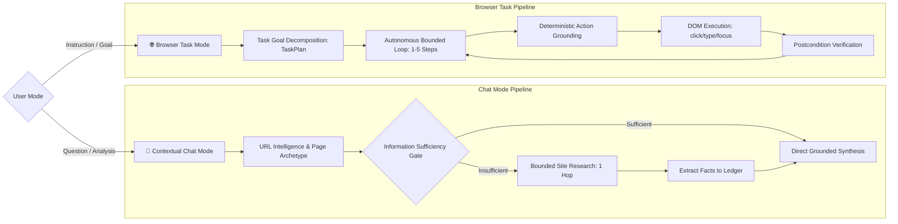

# NexVision — Technical Architecture Specification

**Document Version**: 2.0.0
**Status**: Canonical Architecture Document
**Date**: October 3, 2026
**Repository**: [https://github.com/Tanish-8/NexVision](https://github.com/Tanish-8/NexVision)

---

## 1. System Overview

NexVision is a privacy-first, on-device AI browser agent implemented as a Chromium Manifest V3 browser extension. It enables a local multimodal model (Qwen2.5-VL-3B-Instruct running via `llama-server` on `127.0.0.1:8080`) to perceive web pages, understand page semantics, evaluate information sufficiency, execute bounded research, and autonomously complete multi-step browser tasks.

The core architectural invariant is the **Local Privacy Boundary**: webpage data, screenshots, and user queries are processed and sanitized **strictly on-device** before exposure to local model inference. Zero telemetry, page contents, credentials, or prompts are transmitted to cloud AI services.

```mermaid
graph TD
    User([User Prompt / Instruction]) --> Popup[Popup UI: Chat & Browser Task]
    Popup -->|IPC Message| BG[Background Service Worker]

    subgraph Browser Tab Runtime
        CS[Content Script]
        DOM[DOM Perception]
        ACT[DOM Action Executor]
        CS --> DOM
        CS --> ACT
    end

    BG <-->|Chrome IPC / Scripting| CS
    BG -->|Tab Capture| Screen[Tab Screenshot Capture]

    DOM --> PageRep[Unified PageRepresentation]
    Screen --> PageRep

    PageRep --> Privacy[Privacy Sanitizer & PII Redactor]
    Privacy --> SanitizedRep[Sanitized Page State]

    subgraph Local AI Inference Boundary (127.0.0.1:8080)
        SanitizedRep --> LLMClient[Local Llama Client]
        LLMClient --> Model[Qwen2.5-VL-3B-Instruct]
        Model --> LLMClient
    end

    LLMClient --> Planner[Task Planner / Chat Researcher]
    Planner --> Grounding[Action Grounding & Validation]
    Grounding --> BG
    BG -->|Dispatch Action| ACT
```

---

## 2. Dual Operating Modes

NexVision operates in two distinct, complementary modes:



### 2.1 Contextual Chat & Grounded Research Mode
- **Objective**: Answer questions, summarize articles, compare options, and find products on the current site.
- **Workflow**:
  1. Captures and sanitizes the active page representation.
  2. Parses URL semantics (domain, canonical URL, page type, query parameters).
  3. Evaluates information sufficiency via `evaluateInformationSufficiency`:
     - If the active DOM is sufficient, directly answers using grounded context.
     - If insufficient (e.g. asking for products while on a homepage), formulates a site-search query.
  4. Dispatches an atomic search action (`type` with `pressEnter: true`) to the primary searchbox.
  5. Perceives the resulting search results page, sanitizes it, and extracts structured facts (`ExtractedFact[]`).
  6. Synthesizes a structured response clearly distinguishing current-page facts, search-result facts, and unverified criteria.
  7. Enforces strict untrusted-data boundaries to defend against prompt injection.

### 2.2 Autonomous Browser Task Mode
- **Objective**: Execute multi-step user instructions across form submissions, searches, navigation, and e-commerce tasks.
- **Workflow**:
  1. Decomposes the high-level goal into a structured `TaskPlan` with archetype classification (`form_submission`, `search_and_review`, `navigation_act`, `comparison_shopping`).
  2. Dynamically allocates a step budget (1–5 steps based on plan phases).
  3. Executes an autonomous perceive-ground-plan-execute-verify loop:
     - Perceives the DOM and captures visual observations.
     - Grounds proposed actions to verified `ActionTarget`s with role and coordinate checks.
     - Executes actions via synthetic DOM events.
     - Verifies milestone outcomes before advancing phases.

---

## 3. Workspace & Component Architecture

NexVision is organized as a lightweight TypeScript monorepo with two primary workspaces:

```text
NexVision/
├── extension/             # Chrome Manifest V3 Extension
│   ├── src/
│   │   ├── background/    # Background Service Worker, Research & Agent Coordination
│   │   ├── content/       # Content Scripts, DOM Perception & DOM Execution
│   │   ├── popup/         # Dual-Mode Popup UI & State Management
│   │   ├── privacy/       # PII Detection, Luhn Validator & Privacy Sanitizer
│   │   └── shared/        # Shared Contracts, Types, URL Intelligence & Messaging
│   └── dist/              # Production Extension Bundle
└── vision/                # Standalone Local Vision Perception Package
    ├── src/               # Vision Adapters & Coordinate Normalizers
    └── tests/             # Vision Regression Test Suite
```

---

## 4. Subsystem Specifications

### 4.1 Manifest V3 & Extension Lifecycle

- **Manifest Configuration** (`extension/manifest.json`):
  - Manifest Version: `3`
  - Permissions: `activeTab`, `scripting` (minimal privilege model).
  - Host Permissions: `<all_urls>` (required for active tab DOM perception and injection).
  - Background Service Worker: `background/service-worker.js` (`type: "module"`).
  - Content Script: `content/content-script.js` (`run_at: "document_idle"`).
- **Service Worker Lifecycle & Keepalive**:
  - Manifest V3 service workers terminate after 30 seconds of inactivity.
  - During local AI inference (which can take 2–6 seconds on local models), NexVision maintains keepalive pings via `Promise.race` and asynchronous message response channels (`sendResponse` with `return true`).
- **Content Script Idempotency & Recovery**:
  - Handled in `content/content-script.ts`:
    ```typescript
    if ((window as any).__nexvision_initialized__) {
      // Idempotent guard: prevents duplicate chrome.runtime.onMessage listeners
    } else {
      (window as any).__nexvision_initialized__ = true;
      chrome.runtime.onMessage.addListener(...);
    }
    ```
  - When background detects `Receiving end does not exist` (e.g. extension reloaded while tab remained open), `createDomProvider` catches the transport error, injects `content/content-script.js` programmatically via `chrome.scripting.executeScript`, and retries extraction cleanly.

### 4.2 DOM Perception Subsystem

Located in `extension/src/content/domPerception.ts`:
- **Query Strategy**: Uses `PERCEPTION_SELECTOR` targeting semantic elements (`button`, `a[href]`, `input`, `select`, `h1..h6`, `form`, `main`, `nav`, `dialog`, etc.).
- **Identity Bridge**: Assigns deterministic element IDs (`elem-1`, `elem-2`) stored in `perceptionElementRegistry`, ensuring the background executor can map actions back to real live DOM nodes.
- **Extracted Attributes**:
  - Viewport dimensions and CSS bounding boxes.
  - Semantic ARIA roles, labels, and states (`visible`, `disabled`, `inert`).
  - Document title and URL.
  - **Canonical URL**: Harvested from `<link rel="canonical">`.
  - **Meta Description**: Harvested from `<meta name="description">` or OpenGraph `og:description`.
  - **Structured Data**: Safely parses schema.org JSON-LD (`<script type="application/ld+json">`) for `Product` entities (name, price, currency, brand, ratings, reviews).
  - **Search Controls**: Discovers search inputs by `<input type="search">`, `role="searchbox"`, or common query names (`k`, `q`, `field-keywords`).
  - **Relevant Links**: Filters top semantic links into categories (`product`, `search`, `navigation`).
- **Privacy Guarantee**: Raw input values, password fields, hidden inputs, and textarea bodies are **never** harvested into the DOM representation.

### 4.3 Visual Perception Subsystem

Located in `extension/src/background/screenshot.ts` and `background/llamaVisionAdapter.ts`:
- Captures active tab visible viewport via `chrome.tabs.captureVisibleTab` as JPEG/WebP.
- Encodes image into Base64 data URL for local multimodal model inspection.
- Normalizes pixel coordinates from high-DPI displays to CSS viewport pixel coordinates.
- **Fast Timeout & Fallback**: If local visual inference times out or fails (e.g. GPU device-loss or heavy load), the system seamlessly falls back to pure DOM perception without failing the task.

### 4.4 Unified Page Representation Schema

Defined in `extension/src/shared/types.ts`:
```typescript
export interface PageRepresentation {
  schemaVersion: '1.0';
  metadata: PageMetadata;
  viewport: ViewportDimensions;
  elements: readonly PageElement[];
  dialog?: PageDialogInfo;
  activeElementId?: string;
}

export interface PageMetadata {
  title?: string;
  url?: string;
  canonicalUrl?: string;
  hostname?: string;
  domain?: string;
  description?: string;
  pageType?: PageType;
  searchControls?: readonly PageSearchControl[];
  relevantLinks?: readonly PageRelevantLink[];
  productData?: PageProductData;
  openGraph?: Record<string, string>;
  structuredData?: readonly Record<string, any>[];
  extractionTimestamp?: number;
  completeness?: 'complete' | 'partial' | 'restricted' | 'unavailable';
}
```

### 4.5 Local Privacy Engine & Sanitizer

Located in `extension/src/privacy/sanitizer.ts`, `detector.ts`, and `luhn.ts`:
- **Deterministic Redaction**:
  - Credit Cards: Identified via regex and validated with the Luhn checksum algorithm (`[REDACTED_CARD]`).
  - Emails: Redacted via standard RFC patterns (`[REDACTED_EMAIL]`).
  - Phone Numbers: E.164 and localized formats redacted (`[REDACTED_PHONE]`).
  - Names: Pattern-matched capitalized word clusters filtered through a negative dictionary of UI verbs and tech brand names (`[REDACTED_NAME]`).
- **Anchor `href` Parameter Scrubbing**:
  - Plugged security vulnerability: all anchor `href` attributes pass through `sanitizeUrl()`, stripping query parameters such as `token`, `auth`, `key`, `password`, and `session_id`.
- **Structured Metadata Sanitization**:
  - Recursively scrubs JSON-LD entities before LLM prompt construction.

### 4.6 URL Intelligence & Research Engine

Located in `extension/src/shared/urlIntelligence.ts` and `extension/src/background/chatResearcher.ts`:
- **URL Parsing**: Deterministically parses protocol, hostname, registered domain (eTLD+1), path segments, and query parameters.
- **Page Archetype Classification**:
  - `home`: Root path `/`, portal indicators.
  - `search_results`: Presence of `q=`, `k=`, search filters, result grids.
  - `product`: Schema.org `Product`, `/dp/`, `/product/`, price and add-to-cart controls.
  - `article`: `<article>` tags, publication metadata, author details.
  - `documentation`: Code blocks, API reference hierarchies.
  - `restricted`: `chrome://`, internal browser URLs.
- **Information Sufficiency Gate**:
  - Evaluates whether the active DOM can satisfy user query intent across 8 categories (`product_discovery`, `product_comparison`, `website_search`, `current_page_question`, `url_analysis`, `article_analysis`, `cross_page_research`, `general_question`).
  - If insufficient and on an e-commerce or catalog site, formulates candidate query (`extractSiteSearchQuery`) and triggers bounded research.
- **Evidence Extraction Ledger**:
  - Harvests structured facts into `ExtractedFact` objects:
    ```typescript
    export interface ExtractedFact {
      id: string;
      entityName?: string;
      field: string;
      value: string;
      sourceUrl: string;
      sourceTitle?: string;
      evidenceType: EvidenceType;
      verified: boolean;
      timestamp?: number;
    }
    ```
- **Evidence-Grounded Prompting**:
  - Delimits untrusted page content.
  - Injects verified evidence ledger.
  - Instructs model to cite verified facts and explicitly state unverified criteria.

### 4.7 Action Grounding & Deterministic Execution

Located in `extension/src/shared/grounding.ts`, `shared/actions.ts`, `background/executor.ts`, and `content/domExecutor.ts`:
- **Target Verification**:
  - Verifies target DOM element connection (`isConnected`).
  - Verifies visibility, non-inert status, and actionable state.
  - Verifies target role compatibility (e.g. `textbox` compatible with `searchbox`).
- **Synthetic Event Dispatch**:
  - `type`: Sets native input prototype value (supporting React/Vue synthetic event tracking), dispatches `beforeinput`, `input`, and `change` events. If `pressEnter: true`, dispatches Enter key sequence and triggers `form.requestSubmit()`.
  - `click`: Scrolls element into view, focuses, and dispatches `pointerdown`, `mousedown`, `pointerup`, `mouseup`, and `click`.
  - `focus`: Focuses element safely.
- **Privacy Safe Output**: Typed text strings and passwords are **never** returned in execution results or logged in telemetry.

### 4.8 Task Planning & Autonomous Loop

Located in `extension/src/shared/planner.ts` and `extension/src/background/demoRunner.ts`:
- **Goal Decomposition**:
  - Decomposes user goal into `TaskPlan` with archetype (`form_submission`, `search_and_review`, `navigation_act`, `comparison_shopping`).
  - Defines ordered phases with extracted parameters and expected milestone outcomes.
- **Bounded Autonomous Loop**:
  - Max step budget: 1 to 5 actions.
  - Validates postconditions after each action before declaring a phase complete.
  - Emits real-time progress events to popup UI.

### 4.9 Local Model Inference Client

Located in `extension/src/background/localAgent.ts`:
- `DefaultLocalLlamaChatClient`: Connects to `http://127.0.0.1:8080/v1/chat/completions`.
- **Candidate Compaction**: Caps interactive element candidates to 20 to prevent context overflow.
- **HTTP 400 Mitigation**: Detects context length overflow errors from `llama-server` and automatically truncates history/context before retrying.
- **JSON Repair & Normalization**: Strips markdown code blocks (````json ... ````), fixes common schema deviations, and validates proposals against `IntendedAction` schema.

---

## 5. Security Architecture & Threat Models

| Threat | Vulnerability Addressed | Mitigation Implemented |
| :--- | :--- | :--- |
| **Indirect Prompt Injection** | Webpage text attempts to override model instructions. | Webpage text is enclosed inside immutable `[Current Webpage Context - Untrusted Page Content]` boundaries. System prompt explicitly forbids following instructions embedded in page text. |
| **Credential & Secret Leaks** | Webpages include session tokens or auth keys in links. | All URLs and anchor `href`s pass through `sanitizeUrl()`, redacting sensitive query parameters (`token`, `auth`, `key`, `password`, `session_id`). |
| **PII Data Exfiltration** | Sensitive customer data sent to AI model. | Luhn-checked card redaction, regex email/phone redaction, customer name scrubbing. All inference is strictly on-device on `127.0.0.1:8080`. |
| **Arbitrary Code Execution** | Model attempts to run malicious JavaScript in page. | No `eval()`, no arbitrary code execution. Actions are restricted to strictly typed and validated `click`, `type`, and `focus` events. |
| **Infinite Navigation Crawling** | Autonomous agent gets stuck in infinite redirect loop. | Hard bounded budget: Chat research capped at 1 hop (max 2); Browser tasks capped at 5 steps. Restricted browser schemes (`chrome:`, `file:`) forbidden. |

---

## 6. Testing Architecture

NexVision utilizes a comprehensive automated test suite with **1,119 passing tests**:

```text
Test Suite Breakdown:
├── extension/
│   ├── shared/urlIntelligence.test.ts        (25 tests) - URL parsing, domains, archetypes
│   ├── background/chatResearcher.test.ts     (12 tests) - Intent, sufficiency, research loop
│   ├── background/chatContext.test.ts        (12 tests) - Chat prompt assembly & boundaries
│   ├── content/domPerception.test.ts         (51 tests) - Semantic DOM, JSON-LD, search affordances
│   ├── privacy/privacyEngine.test.ts         (55 tests) - Luhn card checks, PII, href scrubbing
│   ├── background/executor.test.ts           (42 tests) - Action execution & safety validation
│   ├── background/demoRunner.test.ts        (136 tests) - Autonomous loop & phase progression
│   ├── background/service-worker.integration (17 tests) - IPC messaging, reinjection recovery
│   ├── popup/popup.test.ts                    (9 tests) - Dual-mode UI & dynamic status
│   └── other unit & integration tests       (690 tests) - Coordinates, grounding, planner
└── vision/
    ├── visionPerception.test.ts              (21 tests) - Bounding box scaling & validation
    ├── localVisionAdapter.test.ts            (25 tests) - Multimodal observation formatting
    └── llamaInference.test.ts                (24 tests) - Local llama endpoint integration
Total: 1,119 / 1,119 tests passing (100%)
```

---

## 7. Architectural Decisions Log (ADRs)

1. **ADR-001: Manifest V3 with ES Modules in Service Worker**: MV3 service workers cannot use `importScripts` for ES modules. All background code uses static ESM imports bundled via TypeScript.
2. **ADR-002: Deterministic Action Grounding vs End-to-End Visual Coordinates**: Rather than relying purely on model-generated coordinate clicks (which hallucinate on responsive layouts), NexVision grounds actions to semantic DOM elements with verified bounding boxes.
3. **ADR-003: Pure Deterministic URL Intelligence**: URL parsing, domain extraction, and archetype classification are implemented as pure, zero-dependency functions (`urlIntelligence.ts`), enabling 100% test coverage and sub-millisecond execution.
4. **ADR-004: Bounded Research in Chat Mode**: Chat Mode does not execute unbounded autonomous browsing. It is strictly limited to 1 hop (max 2) on the same domain to retrieve necessary product/catalog evidence before generating answers.
5. **ADR-005: Idempotent Content Script Reinjection**: Solves the standard Chrome extension disconnect issue when extensions are reloaded during development or runtime restarts.
