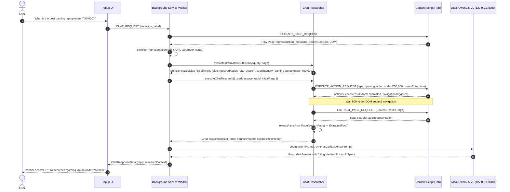

# NexVision — URL Intelligence & Bounded On-Site Research

**Document Version**: 1.0.0
**Status**: Canonical Specification for URL-Aware Intelligence
**Date**: October 3, 2026
**Repository**: [https://github.com/Tanish-8/NexVision](https://github.com/Tanish-8/NexVision)

---

## 1. Problem Statement & Motivation

Prior to the introduction of URL-Aware Contextual Intelligence, NexVision's Chat Mode operated solely on visible text snippets harvested from the active page's DOM.

When a user asked a discovery question on an e-commerce or directory homepage:
> *"What is the best gaming laptop under ₹50,000 available on this page?"* while on `https://www.amazon.in/`

The system invariably halted and answered that no such products were available. This failure was rooted in four architectural limitations:
1. **Passive visible text**: Homepage visible text consisted only of promotional hero banners.
2. **Zero URL & domain semantics**: The model received only a raw URL string without domain understanding, canonical links, or page archetype classification.
3. **Absence of research loops**: Chat Mode was a single-shot completion with no information sufficiency evaluation and no ability to perform actions.
4. **Passivity instruction**: The system prompt instructed the model to state information is unavailable rather than guess.

---

## 2. Architecture & Data Flow



---

## 3. Subsystem Breakdown

### 3.1 URL Intelligence Module (`shared/urlIntelligence.ts`)
A 100% pure, deterministic utility with zero external dependencies:
- **`parseUrlDetails(url)`**: Parses protocol, hostname, registered domain (eTLD+1), path segments, and query parameters.
- **`classifyPageType(url, title, hints)`**: Deterministically categorizes pages into archetypes:
  - `home`: Root path `/`, portal keywords in title.
  - `search_results`: Presence of `q=`, `k=`, search filters, product grid.
  - `product`: Schema.org `Product`, `/dp/`, `/product/`, price and cart controls.
  - `article`: `<article>`, author, publication date.
  - `documentation`: Code blocks, API reference structure.
  - `restricted`: `chrome://`, internal browser URLs.
  - `generic`: Fallback.
- **`extractSearchQueryParam(url)`**: Extracts query keywords from standard URL query parameters (`q`, `k`, `query`, `search`, `p`).
- **`isRestrictedUrlScheme(url)`**: Enforces safety by rejecting `chrome:`, `edge:`, `about:`, `file:`, `javascript:`, `data:`.
- **`isSafeDestinationUrl(target, source)`**: Prevents cross-origin redirects during bounded research.

### 3.2 Enhanced DOM Perception (`content/domPerception.ts`)
- **Canonical URLs**: Extracted from `<link rel="canonical">`.
- **Meta Description**: Extracted from `<meta name="description">` or `og:description`.
- **Structured Data Harvesting**: Parses schema.org JSON-LD `<script type="application/ld+json">` for `Product` entities, extracting name, price, currency, brand, and rating value.
- **Search Control Discovery**: Extracts search inputs (`role="searchbox"`, `<input type="search">`, `name="k"`, `name="q"`, `name="field-keywords"`), capturing element IDs and form action URLs.
- **Semantic Link Extraction**: Filters top links into `product`, `search`, and `navigation` categories.

### 3.3 Intent & Sufficiency Gate (`background/chatResearcher.ts`)
- **Query Cleaning (`extractSiteSearchQuery`)**: Strips polite conversational prefixes (*"Please find me"*, *"What is the best"*) and trailing location phrases (*"available on this page"*), preserving numerical budget constraints.
- **Sufficiency Decision (`evaluateInformationSufficiency`)**:
  - Classifies queries into 8 archetypes (`product_discovery`, `product_comparison`, `website_search`, `current_page_question`, `url_analysis`, `article_analysis`, `cross_page_research`, `general_question`).
  - Evaluates whether the active DOM can satisfy the request. If on a homepage and asked for specific catalog items, flags `isSufficient: false` and triggers `site_search`.

### 3.4 Bounded Research Execution (`executeChatResearch`)
- Locates primary search input on active page.
- Dispatches atomic `type` action with `clearFirst: true` and `pressEnter: true` through `executor.ts` and `domExecutor.ts`.
- Waits for DOM settle and re-perceives the new page via `createDomProvider(tabId)`.
- Sanitizes the new page representation through `sanitizePageRepresentation`.
- **Strict Limit**: Hard-bounded to 1 research hop (max 2) on the same domain. Never crawls recursively.

### 3.5 Evidence Extraction & Ledger (`extractFactsFromPage`)
Captures verified atomic facts into structured `ExtractedFact` objects:
```typescript
export interface ExtractedFact {
  readonly id: string;
  readonly entityName?: string;
  readonly field: string;
  readonly value: string;
  readonly sourceUrl: string;
  readonly sourceTitle?: string;
  readonly evidenceType: EvidenceType;
  readonly verified: boolean;
  readonly timestamp?: number;
}
```
- Extracts product names, prices, brands, and ratings from JSON-LD.
- Scans candidate product card headings and adjacent price tags (`₹`, `$`).

### 3.6 Evidence-Grounded Prompt Synthesis (`buildEvidenceGroundedPrompt`)
Constructs prompt containing:
1. Untrusted page context boundary.
2. Verified research evidence ledger with source attribution.
3. Strict instructions:
   - Cite verified facts and exact prices.
   - Clearly state unverified or missing criteria.
   - Never invent or hallucinate specifications.

---

## 4. Implementation Status Matrix

| Capability | Status | Implementation Details | Verified By |
| :--- | :---: | :--- | :--- |
| **URL Parsing & eTLD+1 Domain** | **Implemented** | `urlIntelligence.ts:parseUrlDetails` | `urlIntelligence.test.ts` (25 tests) |
| **Page Archetype Classification** | **Implemented** | `urlIntelligence.ts:classifyPageType` | `urlIntelligence.test.ts` |
| **Canonical URL Extraction** | **Implemented** | `domPerception.ts` (<link rel="canonical">) | `domPerception.test.ts` |
| **Meta & OpenGraph Extraction** | **Implemented** | `domPerception.ts` (<meta name="description">) | `domPerception.test.ts` |
| **Schema.org JSON-LD Extraction** | **Implemented** | `domPerception.ts` (JSON-LD Product) | `domPerception.test.ts` |
| **Search Input Discovery** | **Implemented** | `domPerception.ts:extractSearchControls` | `domPerception.test.ts` |
| **Anchor Href Parameter Scrubbing** | **Implemented** | `sanitizer.ts:sanitizeElement` | `privacyEngine.test.ts` |
| **Brand Name Whitelisting** | **Implemented** | `detector.ts:COMMON_UI_AND_BRAND_WORDS` | `privacyEngine.test.ts` |
| **Search Query Extraction** | **Implemented** | `chatResearcher.ts:extractSiteSearchQuery` | `chatResearcher.test.ts` |
| **Information Sufficiency Gate** | **Implemented** | `chatResearcher.ts:evaluateInformationSufficiency` | `chatResearcher.test.ts` |
| **Bounded Research Execution** | **Implemented** | `chatResearcher.ts:executeChatResearch` | `chatResearcher.test.ts` |
| **Evidence Ledger Accumulation** | **Implemented** | `chatResearcher.ts:extractFactsFromPage` | `chatResearcher.test.ts` |
| **Evidence-Grounded Prompting** | **Implemented** | `chatResearcher.ts:buildEvidenceGroundedPrompt` | `chatResearcher.test.ts` |
| **Service Worker Integration** | **Implemented** | `service-worker.ts:CHAT_REQUEST` | `service-worker.integration.test.ts` |
| **Popup UI Research Indicator** | **Implemented** | `popup.ts:setThinking` dynamic label | `popup.test.ts` |
| **Multi-Hop Research (>1 Hop)** | **Planned (M3)** | Traversal of multiple links across pages | Roadmap Milestone M3 |
| **Multi-Site Cross-Search** | **Planned (M3)** | Comparing results across 2+ distinct websites | Roadmap Milestone M3 |
| **Tabbed Search Execution** | **Planned (M3)** | Opening search results in background tab | Roadmap Milestone M3 |

---

## 5. Verification & Safety Limits

1. **Hop Limit**: Strictly bounded to 1 hop.
2. **Domain Boundary**: Actions restricted to same eTLD+1 domain.
3. **Execution Timeout**: Action execution times out after 5,000ms.
4. **Untrusted Data Isolation**: All page text wrapped in security delimiters.
5. **Deterministic Action Verification**: Target inputs verified for visibility and DOM connection before typing.
